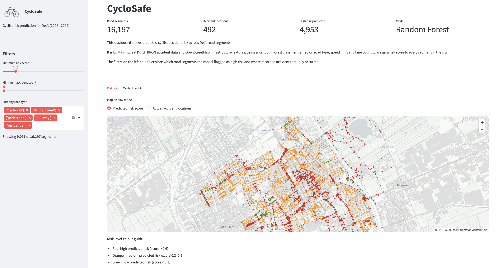
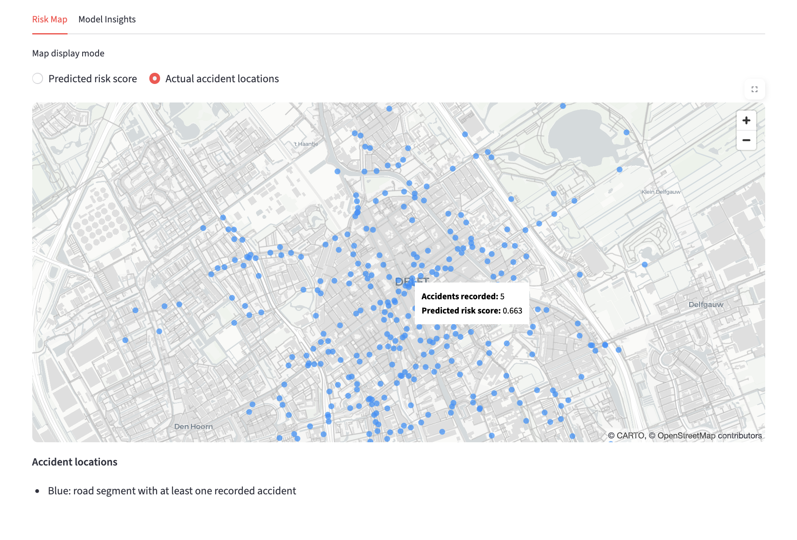
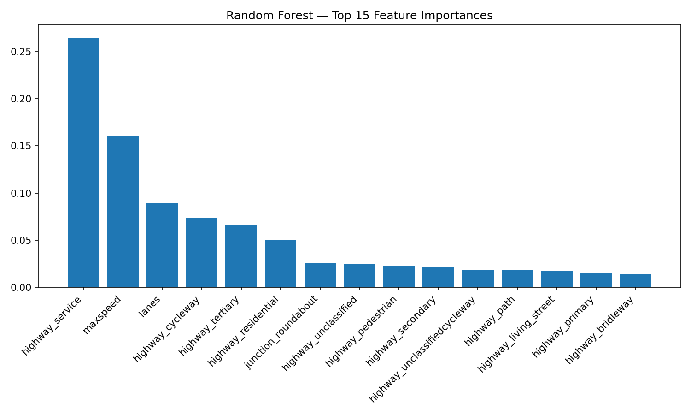
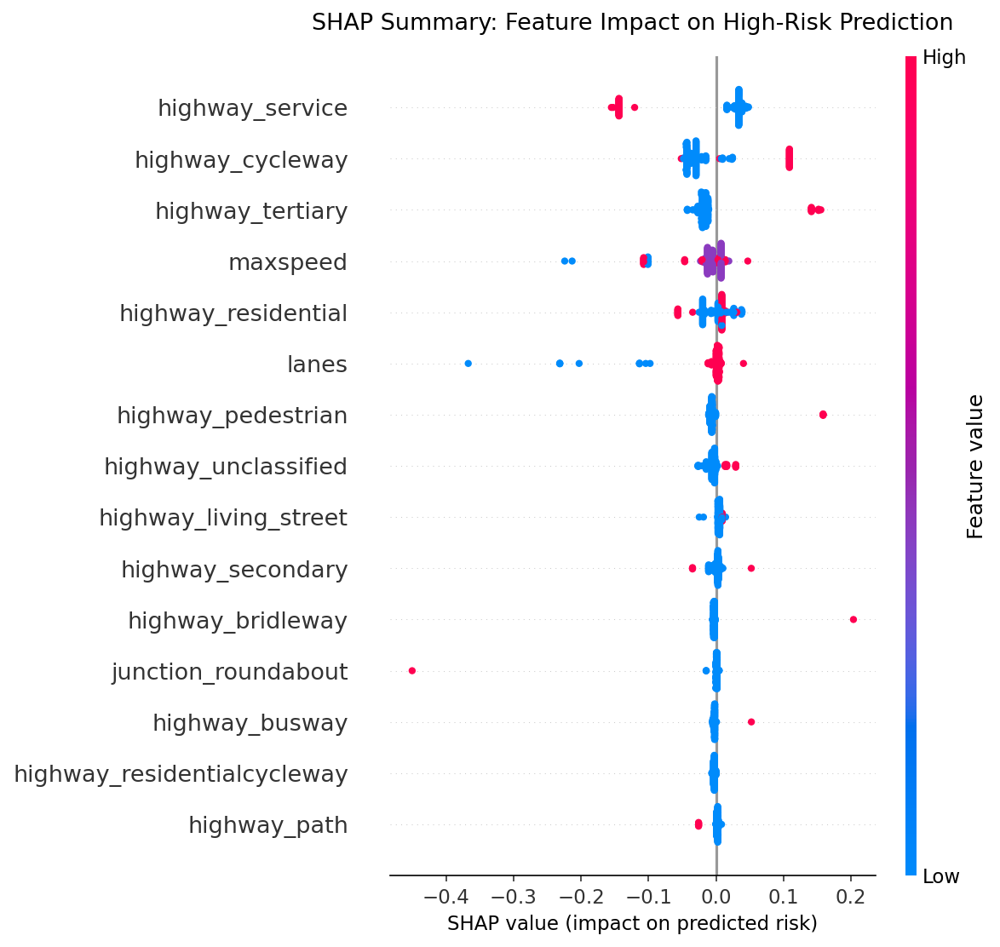
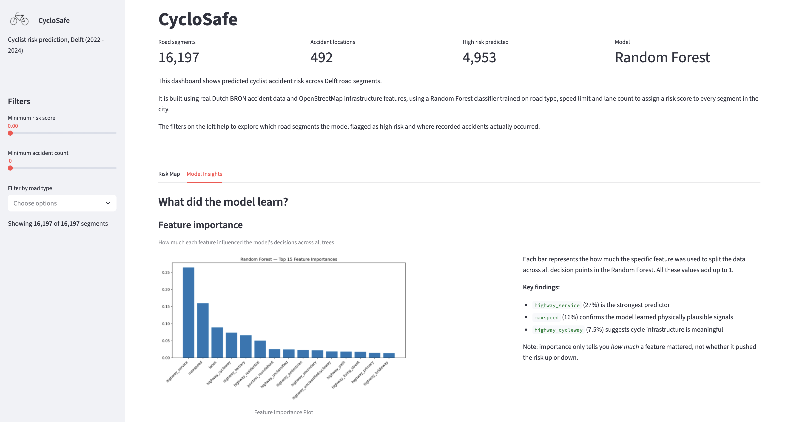
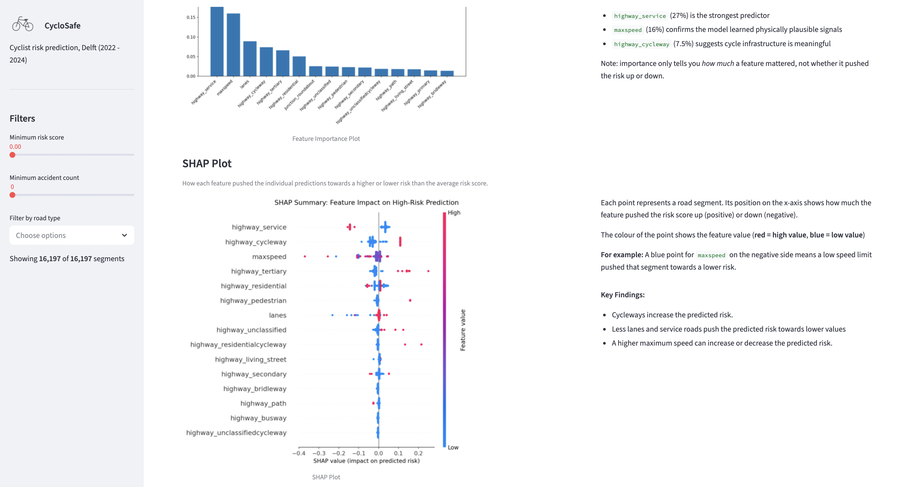
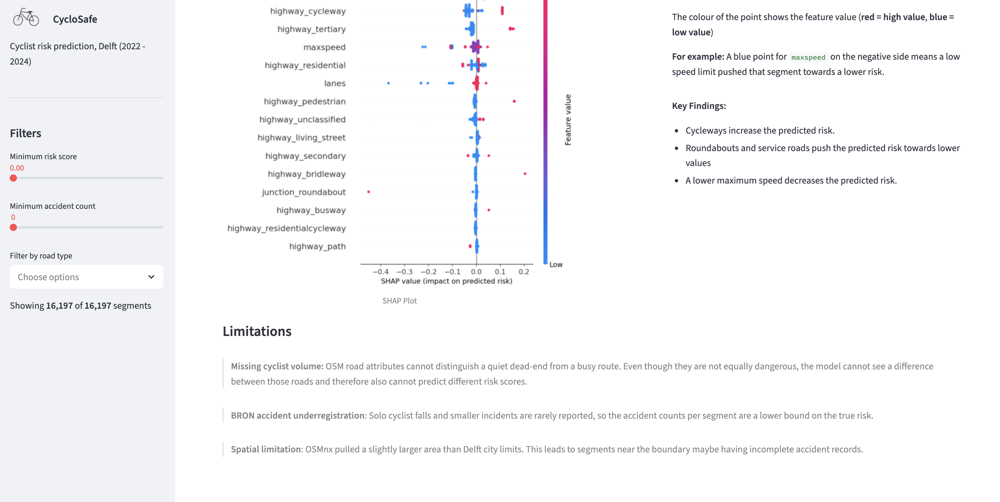

<h1 style="display: flex; align-items: center;">
  
  CycloSafe
</h1>

CycloSafe predicts accident hotspots for cyclists on road segments in Delft (Netherlands) using real Dutch open data.

## What I Built

I developed an end-to-end ML pipeline to analyse the risk of bike accidents in Delft. Joining the BRON accidents dataset (2022-2024) with OpenStreetMap road infrastructure data (retrieved via OSMnx), the model predicts the risk of a bike accident happening on a specific road segment. I compared a Logistic Regression baseline with a Random Forest classifier to evaluate performance and analysed how different road infrastructure features correlate with the number of accidents happening. The final results are shown in an interactive Streamlit dashboard with a Pydeck risk map to help visualise high-danger zones and accident locations.

### Dashboard Preview

The dashboard is fully interactive, allowing users to filter road segments by type and explore high-risk areas based on a minimum risk score and accident count.


<div align="center">
  <em>Figure 1: The dynamic CycloSafe dashboard, designed to help users explore and filter predicted collision risks on the streets of Delft.</em>
</div>

<br>
<br>

 The CycloSafe map of actual accidents shows the collision locations across the road network. Hovering over a specific data point reveals more information on the risk score and the amount of accidents that occured.


<div align="center">
  <em>Figure 2: The CycloSafe Actual Accident Locations Map</em>
</div>

<br>


## Key findings

To evaluate the Random Forest model, I used a Feature Importance plot to show which features were the most useful for the learning of the model and an SHAP summary to determine which features pushed the predicted risk towards higher or lower values.

### Feature Importance 

In the following plot, each bar shows how much a specific feature contributed to the model's decision across all Random Forest trees. The values sum up to 1 (e.g. a bar at 0.27 means that feature was responsible for 27% of all splits/ decision points). A taller bar means the model relied on that specific feature more.


<div align="center">
  <em>Figure 3: Feature Importance Plot: The general impact of different features on the model's decision.</em>
</div>

<br>

In total, the plot shows that the model learned from different features of the data and tries to make decisions based on different factors (more detailed findings are stated below).


### SHAP Summary

The SHAP plot below explains what the model learned from the data it had. 
- Each point in the plot represents one road segment.
- The horizontal position of the point determines how strongly the corresponding feature pushed the predicted risk score up (right) or down (left).
- The colour of a point shows the segment's actual feature value. 
For example for cycleways: if the point is red (=1) the segment actually is a cycleway, if the point is blue (=0) the point is not a cycleway. For maxspeed: the higher the feature value, the higher the maximum allowed speed.



<div align="center">
  <em>Figure 4: SHAP Plot: How much different features pushed a specific prediction towards higher or lower risk.</em>
</div>


### Findings

> **Cycleways:** This is a counterintuitive finding. From the SHAP plot it becomes visible that highway_cycleway increases the risk the model is predicting. I would have expected the dedicated cycling infrastructure to push the predicted risk towards lower values. BRON records the number of accidents, but not the number of cyclists per road segment. So the reason for this finding could be, that a very large amount of cyclists are driving on the cycleways. More cyclists means more accidents occur and are recorded. Thus, infrastructure explicitly designed for bikes appears to be risky for the model as many accidents happen, but the large number of accidents is just a consequence of the huge cyclist amount.

> **Speed:** Maxspeed is the second strongest signal, which makes sense as a higher speed limit causes more frequent and severe accidents. The SHAP summary shows that lower speed pushes the risk towards lower values. The violet color stands for a moderate speed which does not influence the model as much. What stands out is, that a higher speed limit does not necessarily increase the predicted risk, but also does not reduce it. The reason for this could be that roads with higher speed limits also have safer road infrastructure, which is keeps the risk from increasing above average.

> **Lanes:** More lanes on a road segment generally indicate busier and wider roads. The SHAP plot shows, that more lanes push toward lower risk. This seems unexpected at first, as busier roads could be more chaotic and thus lead to a higher risk. But it actually makes sense because this danger is prevented by wider roads often having better cycling infrastructure or clearer lane separation.

> **Service roads:** The feature importance plot shows that service roads (access roads, parking aisles, driveways, and back-of-building roads) have the highest impact on the model's decision. I would have assumed the maxspeed to be more impactful. From the SHAP plot it becomes visible that service roads reduce the predicted risk for accidents to happen. The reason for this might be, that they are low-speed roads where cyclists and (possibly turning) cars drive attentively and carefully.

> **Roundabout:** In the SHAP plot junction_roundabout has one red point at -0.45. This shows that roundabouts reduce the predicted risk by a lot. This makes sense because dutch roundabouts separate cyclists from cars which leads to less accidents.

<br>

Overall, these results show how various road characteristics (e.g. cycleways or other road types, a maximum speed limit and street infrastructure) impact the accident rate on different road segments and give insight into how they influence the risk prediction (e.g. pushing the risk up or down) of the Random Forest classifier.

<br>

To give users insight into how the model came to its conclusions and help with an understanding of the model's work, I included those plots into a "Model Insights" tab of the dashboard.


<div align="center">
  <em>Figure 5: The Feature Importance plot in the "Model Insights" tab of the dashboard.</em>
</div>

<br>
<br>


<div align="center">
  <em>Figure 6: The SHAP plot in the "Model Insights" tab of the dashboard.</em>
</div>


## Results

To evaluate the model, I calculated the achieved F1 Score, precision and recall.

- Precision: of all the segments that were predicted as high-risk, how many actually were?
- Recall: of all the segments that were actually high-risk, how many were found by the model?
- F1 Score: mean of precision and recall, summarising how well a classifier performs on an imbalanced dataset

I did not just use and show the accuracy of the model, because the dataset has 858 high risk segments out of 116625. A model that classifies every segment as low-risk would get a very high accuracy (over 99%), but would in reality be completely useless. 

| Model | F1 Score | Precision | Recall |
| :--- | :---: | :---: | :---: |
| Logistic Regression | 0.025 | 0.013 | 0.599 |
| Random Forest | 0.027 | 0.014 | 0.552 |

<div align="center">
  <em>Table 1: The F1 Score, Precision and Recall for the Logistic Regression baseline and the Random Forest classifier.
  </em>
</div>

<br>

The F1 Score of both models is very low. This indicates that the models are not able to reliably classify road segments as high- or low-risk. 

As seen in the feature importance and SHAP plot, the model assigns a risk score based on different attributes of the road segments such as road features and maxspeed. These current features (for example the road type) are weak proxies for the actual risk. 

For example, two roads of the same type can have different cycling traffic: one could be a quiet road behind a supermarket and another one could be on a busy lane, used by hundreds of cyclists daily. For the model they would look almost identical, which makes it hard to predict different risks for the two roads.

To fix this, I searched for another dataset that captures the amount of cyclists on the roads of Delft. Adding data on the amount of cyclists per road segment could help the problem as the model could learn to distinguish simply busy roads from actually dangerous roads.

However, the dataset I found (NDW FietsData) only contained data for max. 14 locations in Delft for the year 2024 (for previous years I found even less data points on the website). This is not enough as most roads would get the median fallback value. This makes the feature not useful enough for training, which is why I didn't include it in the final pipeline of the model.

Additionally, only 858 segments out of 116625 are actually high-risk segments which leads to a severe class imbalance. As an attempt to solve this problem, I introduced a class=balanced parameter to the models and undersampled the majority class before training. For the training, I took 15000 randomly sampled negatives and all positives instead of the full dataset. While this helped improving performance, it did not solve the problem completely which is why the model still has a low F1 score.


The threshold determines at which predicted probability the model flags a road segment as high-risk. A lower threshold means the model makes its decisions more aggressively, while a higher threshold means it is more conservative and only marks very dangerous segments as risky. With a threshold sweep on the validation set, I evaluated different thresholds to find which one improves the performance of the model the most. 

| Threshold | F1 Score | Precision | Recall |
| :--- | :---: | :---: | :---: |
| 0.3 | 0.019 | 0.009 | 0.924 |
| 0.4 | 0.020 | 0.010 | 0.866 |
| 0.5 | 0.027 | 0.014 | 0.552 |
| 0.6 | 0.027 | 0.014 | 0.541 |
| 0.7 | 0.026 | 0.024 | 0.029 |
| 0.8 | 0.000| 0.000 | 0.000 |

<div align="center">
  <em>Table 2: Threshold Sweep On The Validation Set.
  </em>
</div>

<br>
As seen in the table, the F1 Score is highest for the threshols 0.5 or 0.6 (0.5 is the default value). No other threshold meaningfully improves the performance of my model, which confirms that the issue is missing features rather than a tuning problem.

<br>

I tried to compare a more complex Random Forest Model to a Logistic Regression baseline, but both models perform similarly as the limiting factor is the data, not the model complexity. 

Even though the F1 score is low, I still used the Feature Importance and the SHAP plot to evaluate the model. This is fine because they are methods that focus on what features the model learned from and how it uses those features for the risk prediction, rather than focusing on the accuracy.


## Limitations & Future Improvements

This project works with real open data which comes with real constraints. Here is what I ran into and what I would fix next.

### Limitations

>**Missing cyclist volume:** OSM road attributes cannot distinguish a quiet dead-end from a busy route. Even though they are not equally dangerous, the model cannot see a difference between busy and dangerous roads and therefore also cannot predict different risk scores for such road segments.

>**BRON accident underregistration:** Solo cyclist falls and smaller incidents are rarely reported, so the accident counts per segment are less than the actual accidents that happened. Therefore, the calculated risk score is a lower bound on the true risk.

>**Spatial limitation:** OSMnx pulled a slightly larger area than the Delft city limits. This leads to segments near the boundary maybe having incomplete accident records.


To ensure transparency, I included a short section about the limitations of my model in the model insights.


<div align="center">
  <em>Figure 7: Limitations in the "Model Insights" tab of the dashboard.</em>
</div>


### Future Improvements

Some ideas and next steps for improving the model:

- Number of cyclist per road data as an additional feature
  - I explored NDW FietsData, but only 14 measurement points/ locations were providing meaningful data for Delft. To find and include more data on the cyclist counts for the streets of Delft would directly help the low F1 score by giving the model more information to learn from.
- Intersection-level modelling
  - Accidents happen more often at intersections than along roads because that is where bikes and cars interact. My current model assigns intersection accidents to nearby road segments, creating noisy labels. Reframing the problem from road segments to intersections could produce a stronger signal on the same data.
- Extend to other municipalities 


## Tech Stack 
I built this project using a Python-based geospatial and ML stack:
- Data Processing: Pandas, OSMnx and GeoPandas for handling the road network graphs and spatial data
- Machine Learning: scikit-learn for the Random Forest classifier and Logistic Regression baseline, SHAP for interpreting feature importance
- Visualisation: Matplotlib for creating the plots, Streamlit for the interactive dashboard and Pydeck for high-performance spatial mapping

## Setup:
Prerequisites:
- Ensure you have Conda or Mamba installed
- Ensure you have an active internet connection (to fetch OSM data)

Clone the repository: 
```bash
git clone https://github.com/lzwahlen/CycloSafe.git
cd CycloSafe
```

Create and activate the conda environment:
```bash
conda env create -f environment.yml
conda activate cyclosafe
```

Run the pipeline and train the model:
```bash
cd src
python pipeline.py
python train.py
python analyse.py
```

Run the dashboard:
```bash
cd ..
streamlit run app/app.py      
```


## Sources

- Logo: CycloSafe bike logo drawn by me
- Accident data: Sourced from the BRON database via ([data.overheid.nl](https://data.overheid.nl/))
    - Dataset version: The specific dataset used is the ongevallen_2022_2024 GeoJSON dataset.
- Road network: Sourced from ([OpenStreetMap](https://www.openstreetmap.org/))
    - Implementation: The road network data was pulled using the osmnx Python library for the regions Delft, Rijswijk, Pijnacker-Nootdorp, Midden-Delfland, Den Haag, and Westland.  


